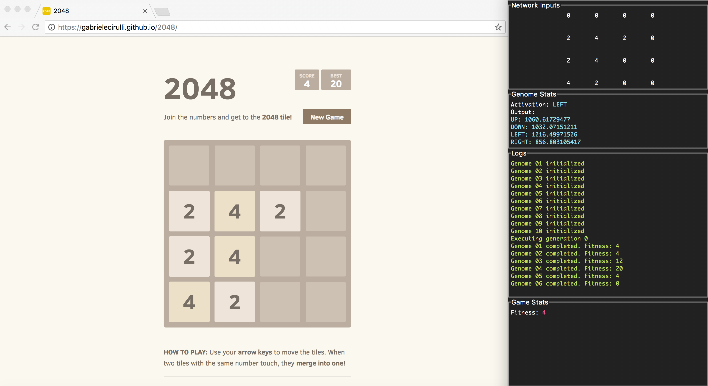

# 2048 AI 

This is an AI written in Python that uses genetic algorithms to learn how to beat the game 2048. 
The game can be found here: https://gabrielecirulli.github.io/2048/

The program randomly generates 10 "Genomes" per "Generation," and selects the top two performers from each Generation to pass their "Genes" onto the next Generation through a crossover algorithm. Each Genome has a 4% probability of being affected by a mutation algorithm which modifies some of its traits. Eventually with enough Generations, the resulting best-performing Genome is capable of consistently reaching a score of over 2048. 

The frontend display on the side is written in tkinter, which updates the HTML being scraped from the website in real-time while helping the user keep track of important data.
